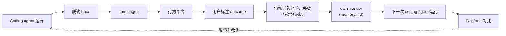

<div align="center">

# 🧠 Cairn Memory

**给 AI Coding Agent 用的本地优先、CLI-first、受治理大脑层。**

Cairn Memory 是给 AI Coding Agent 用的本地受治理记忆层：它先让 Claude Code
从自己的运行中学习，再通过受治理的 CLI 和机器读取接口把这套记忆能力扩展出去。

[](https://github.com/Jerry2003826/OmniAgent/actions/workflows/ci.yml)


[English](README.md) · **简体中文**

</div>

---

AI Coding Agent 经常每次都从零开始：重新扫描仓库、重新摸索该跑哪个测试命令、
把昨天学过的东西再学一遍。**Cairn Memory 把这个循环闭合起来。** 它捕获
coding agent 实际做了什么，转化成可审核的记忆，再喂回下一次运行——让下一次
会话从上一次结束的地方继续。

没有后台服务、没有云、没有向量数据库、没有 LLM 调用。所有状态都在项目本地的
`.omni/` 目录下，并且**写入磁盘前每一个字节都会先脱敏。**

## 🔁 工作原理



一次运行被捕获为脱敏 trace，导入本地 SQLite 存储，做行为评估，并用用户标注的
outcome 锚定。确定性 facts 会变成**经验（experience）**、**失败（failure）**
和**偏好（preference）**候选——只有经过*你*的批准，才会进入记忆。批准后的记忆
被渲染进一个 `memory.md` 区块，供下一次 agent 运行读取；随后一次冷/暖
（cold/warm）对比会度量行为是否真的改善了。

## ✨ 设计原则

- **🔒 本地优先** —— 所有状态都在项目的 `.omni/` 目录。没有后台服务，不联网，无遥测。
- **🧼 写入前脱敏** —— 写入 `.omni/` 的每一个内容字节都先经过脱敏器。没有任何原始转储路径，也没有原始保险库；脱敏不可逆。
- **👤 人工审核** —— facts 先成为*候选*。在你显式批准之前，任何东西都不会进入记忆。没有自动成功推断，也没有自动记忆演化。
- **↩️ 可撤回** —— 已渲染的 guidance 可以被 retire。一条糟糕的经验笔记或失败模式，一旦 retire 就不再出现在 `memory.md` 中。
- **📏 可度量** —— `cairn eval` 和 `cairn eval dogfood` 会量化记忆是否改变了下一次运行的行为，而不是想当然地假设它有效。

## 🚀 快速开始

需要 **Python 3.11+**。零运行时依赖——本工具纯标准库实现；`pytest` 是唯一的开发依赖。

```powershell
# 在本仓库 checkout 内
pip install -e ".[dev]"
cairn --help
pytest -q
cairn audit secrets
```

`cairn` 是首选命令名。为了兼容已有安装，旧的 `omni` 命令、Python module 名和
`.omni/` 状态目录仍然保留。
Package metadata now installs as `cairn-memory`; Python imports still use the
existing `omni` package.

> ⚠️ 在 `cairn audit secrets` 于**本 checkout 和目标项目中都**退出码为 `0` 之前,
> 切勿把 Claude Code hooks 安装进真实项目。

## 📖 使用

### 1. 接入一个受治理的 agent 项目

```powershell
cairn init                              # 创建 .omni/ 布局
cairn audit secrets                     # 安全门禁（必须先通过）
cairn init --install-claude-hooks --yes # 安装捕获 hooks
cairn inject claude --mode preview      # 预览 CLAUDE.md 改动
cairn inject claude --mode link         # 把 memory.md 链接进 CLAUDE.md
cairn inject opencode --mode preview    # 预览 opencode.json instructions
cairn inject opencode --mode link       # 把 memory.md 加进 OpenCode instructions
```

OpenCode 的 `link` 可以读取 JSON 或 JSONC 配置，但写回时会规范化为 JSON；
注释、尾逗号和原始键顺序/格式不会保留。

`cairn inject claude --mode link` 只会改动 `CLAUDE.md` 中下面这个 managed 区块，
你自己的内容永远不会被修改：

```md
<!-- omni:begin -->
@.omni/generated/memory.md
<!-- omni:end -->
```

### 2. 一次受治理的 agent 运行之后

```powershell
cairn ingest                            # 导入脱敏 trace —— 记下 run_id
cairn ingest <run_id> --engine opencode --transcript <utf8-jsonl>
cairn audit secrets
cairn status
cairn eval run <run_id>                 # 这次运行的行为如何？
cairn verify                            # 只读：运行已知的测试命令
cairn outcome mark-from-verify <run_id> --success --task-type validation
```

> 从 `cairn ingest` 打印的 `run_ids=...` 这一行读取新的 `run_id`（不要从
> `cairn status` 取）。只有在验证命令通过、且你已确认任务确实成功之后，才加
> `--success`；否则用 `--failed` 或 `--unknown`。

### 3. 审核、渲染与对比

```powershell
cairn experience extract <run_id>       # 生成经验候选
cairn experience ls
cairn experience approve <exp_cand_id>  # 未批准前不会渲染任何内容

cairn failure extract <run_id>          # 生成失败候选
cairn failure approve <id> --summary "..." --suggested-action "..."

cairn render --diff                     # 预览 memory.md 改动
cairn render                            # 写入 .omni/generated/memory.md

cairn eval dogfood --cold <old_run_id> --warm <new_run_id>
```

写错了？把已渲染的 guidance retire 掉，再重新渲染：

```powershell
cairn experience note retire <note_id>
cairn failure pattern retire <pattern_id>
cairn render
```

## 🧰 命令参考

`R` = 只读（以只读方式打开 SQLite，不跑任何迁移） · `W` = 写 SQLite。

| 区域 | 命令 | R/W | 作用 |
|---|---|:--:|---|
| **接入** | `cairn init [--install-claude-hooks] [--yes]` | — | 创建 `.omni/`；可选安装 Claude Code hooks |
| | `cairn audit secrets` | R | 安全门禁——扫描整个 `.omni/` 树是否有泄露 |
| | `cairn inject claude --mode preview\|link` | — | 管理 `CLAUDE.md` 的 managed 区块 |
| | `cairn inject opencode --mode preview\|link` | — | 将 `.omni/generated/memory.md` 加进项目本地 `opencode.json` instructions |
| **捕获** | `cairn hook` *(自动调用)* | — | 脱敏 hook 输入并追加到 spool；永远退出 `0` |
| | `cairn ingest [--engine claude\|opencode]` | W | 把脱敏 trace 导入本地存储 |
| | `cairn status` | R | 项目健康度：link、database、generated memory |
| | `cairn status --all` | R | 只读的多项目状态概览 |
| | `cairn doctor` | R | 只读项目诊断 |
| **机器读取** | `cairn memory read` | R | 以结构化 JSON 读取渲染后的记忆 |
| | `cairn failure read` | R | 以结构化 JSON 读取 active known failures |
| | `cairn verify plan` | R | 展示会选择的验证命令，但不执行 |
| | `cairn mcp serve` | R | 将只读机器读取视图作为 stdio MCP 工具暴露 |
| **评估** | `cairn eval run <run_id>` | R | 对单次运行做启发式行为评估 |
| | `cairn eval dogfood --cold <id> --warm <id>` | R | 冷/暖行为对比 |
| | `cairn dogfood ...` | R | 汇总 eval/outcome 的 dogfood 视图 |
| | `cairn verify [--qualifier <q>] [--task <t>] [--profile <p>]` | R\* | 运行选中的验证命令（对 Cairn Memory 状态只读） |
| **审核** | `cairn review approve\|reject <id>` | W | 人工审核 deterministic fact candidates |
| | `cairn review interactive` | W | 对 pending facts 做交互式 approve/reject/skip |
| **Outcome** | `cairn outcome mark-from-verify <run_id> ...` | W | 把 `verify` 结果桥接进 outcome log |
| | `cairn outcome mark <run_id> ...` | W | 手动记录一条 outcome |
| | `cairn outcome show\|ls` | R | 查看已记录的 outcomes |
| **经验** | `cairn experience extract\|ls\|show` | R/W | 生成并查看经验候选 |
| | `cairn experience approve\|reject <id>` | W | 把候选批准为 active note（或拒绝） |
| | `cairn experience note ls\|show\|retire` | R/W | 管理已渲染的经验笔记 |
| **失败** | `cairn failure extract\|ls\|show` | R/W | 生成并查看失败候选 |
| | `cairn failure approve\|reject <id>` | W | 把候选批准为 known-failure 模式 |
| | `cairn failure pattern ls\|show\|retire` | R/W | 管理已渲染的失败模式 |
| **偏好** | `cairn preference extract\|ls\|show` | R/W | 生成并查看偏好候选 |
| | `cairn preference approve\|reject <id>` | W | 批准或拒绝偏好候选 |
| | `cairn preference note ls\|show\|retire` | R/W | 管理已渲染的偏好笔记 |
| **项目** | `cairn project register` | W | 注册项目以供多项目概览使用 |
| | `cairn project ls` | R | 列出已注册项目 |
| **任务** | `cairn task start <intent> [--task-type <type>]` | W | 开始一个 open operational task |
| | `cairn task status\|ls\|show` | R | 查看 operational task 状态 |
| | `cairn task read` | R | 以无泄露机器 JSON 读取 open task 上下文 |
| | `cairn task close (--success\|--failed\|--unknown) [--from-verify]` | W | 关闭 open task，并可桥接 verify/outcome |
| | `cairn task abandon [--reason <text>]` | W | 放弃 open task 并清空指针 |
| **渲染** | `cairn render [--diff]` | W | 渲染 `.omni/generated/memory.md` |

\* `cairn verify` 不写任何 Cairn Memory 状态，但它*确实会*执行你项目的验证命令
（例如 `pnpm run test`）。

## 📊 实测结果

来自一个真实 Claude Code 项目的 dogfood 证据（[完整 closeout](docs/cli-only-claude-code-v1-closeout-2026-06-15.md)）。
有了记忆之后，Claude Code 直接用上了正确的测试命令，而不是重新扫描仓库：

| 指标 | ❄️ 冷运行 | 🔥 暖运行 |
|---|:--:|:--:|
| 测试命令前的 rediscovery 次数 | **10** | **0** |
| 首个 expected command | — | `pnpm run test` |
| 在 rediscovery 之前执行了验证 | 否 | **是** |
| `memory_effect` | `failed_to_help` | `neutral`* |

➡️ `command_adopted = true`，`improvement = true`。

\* 单次运行的 `memory_effect` 之所以是 `neutral`，是因为 Claude Code 没有对
`CLAUDE.md`/`memory.md` 发出可检测的 `Read` 事件；**冷/暖对比才是行为确实改变了
的更强信号。**

## 🎯 范围

最初的 v1 版本刻意先证明本地 Claude Code 闭环。当前仓库已经继续加入 Phase B
治理能力，以及已经批准并落地的 Phase C 子集。

Phase C C-2 已在此分支实现并 dogfood 验证 OpenCode v0。它加入项目本地
`opencode.json` instruction 注入，以及 UTF-8 `opencode run --format json`
transcript ingest；不会加入插件后台进程或新迁移。C-4 现在加入
`cairn mcp serve`，把现有机器读取接口包装成只读 stdio MCP 工具。

| ✅ 当前仓库包含 | 🚫 仍不在范围内 |
|---|---|
| 项目本地 `.omni/` 状态 | 后台服务 |
| 基于 capture-engine seam 的 Claude Code hook 捕获 | 可写 MCP server |
| OpenCode v0 config 注入与 transcript ingest | OpenCode plugin 后台捕获 |
| `cairn audit secrets` 安全门禁 | Dashboard / TUI |
| ingest、行为评估、dogfood 对比 | 多 agent 编排 / handoff |
| 用户标注 outcome | LLM extractor |
| 可审核的经验、失败、偏好记忆 | 自动成功 / 失败推断 |
| 可 retire 的已渲染 guidance | 自动记忆演化 |
| 只读的 `cairn verify`、`verify plan`、memory read、failure read、MCP wrapper | 向量 / embedding 检索 |
| task 生命周期（`start/status/ls/show/close/abandon/read`） | 迁移 `001`–`008` 之外的新 DB 表 |
| 确定性的 `memory.md` 渲染与 managed injection | 给外部 agent 的写入路径 |

权威治理与 non-goals 详见 [`AGENTS.md`](AGENTS.md)。

## 🗺️ 路线图

Cairn Memory 采用分阶段路线：一个轻量、本地优先、
受治理的**大脑层，任何 AI Coding Agent 都能接入**——Claude Code、Codex、
OpenCode、QwenCode、Cursor——在不同引擎间复用同一套记忆、验证与失败治理。

| 阶段 | 新增能力 | 状态 |
|---|---|:--:|
| **① Cairn Memory 内核** | 捕获 → 脱敏 → 评估 → outcome → 审核后的经验 / 失败记忆 → 验证桥 | ✅ 已完成 |
| **② Cairn Bridge** | agent-agnostic 的 capture/inject 接缝与只读机器访问接口；OpenCode v0 作为第一个第二引擎证明；C-4 把读取接口包装成 MCP 工具 | ✅ 基础已落地；C-2 已交付；C-4 已交付 |
| **③ Cairn Runtime** | task 生命周期（`start/status/ls/show/close/abandon/read`）与 verify/outcome close bridge；multi-agent handoff 后置 | ✅ C-5 部分落地 |
| **④ Product** | 多 agent 调度、权限分级、审计报告、记忆控制台 | 规划中 |

今天 Claude 仍是唯一已安装的 hook capture 目标。OpenCode v0 使用项目本地
`opencode.json` instructions 和 UTF-8 JSONL transcript ingest；`cairn mcp serve`
提供 `memory_read`、`failure_read`、`verify_plan` 和 `task_read` 四个只读
stdio MCP 工具。

## 🏗️ 架构

状态由一个小型 SQLite 数据库加一个脱敏 spool 组成，全部位于 `.omni/` 下。Hooks
只会向 spool 追加脱敏后的行——它们绝不触碰数据库。渲染出的 `memory.md` 结构如下：

```text
Fast Path  ·  Commands  ·  Experience Notes  ·  Known Failures  ·  Boundaries  ·  Project
```

核心模块位于 [`src/omni/`](src/omni/)：

| 模块 | 职责 |
|---|---|
| `cli.py` | 命令路由（argparse） |
| `redact.py` | 脱敏核心——fail-closed、不可逆 |
| `hook.py` / `spool.py` | 捕获 hook 输入 → 脱敏 spool |
| `parse.py` / `ingest.py` / `store.py` | 解析 transcript、ingest、内容寻址存储 |
| `db.py` | SQLite 连接与迁移（`migrations/001`–`008`） |
| `audit.py` | `cairn audit secrets` 安全门禁 |
| `capture/` | capture engine 注册表，Claude 是第一个实现 |
| `extract/` | 确定性 fact 提取（包管理器、scripts、observed） |
| `gate.py` / `review.py` | fact 审核门禁 |
| `eval.py` | 行为评估与 dogfood 对比 |
| `outcome.py` | 用户标注的 outcome log |
| `experience.py` / `failure.py` / `preference.py` | 候选 → 审核记忆的生命周期 |
| `projects.py` / `doctor.py` | 多项目 registry 与只读诊断 |
| `verify.py` | 只读验证预检 |
| `render.py` / `inject.py` | 渲染 `memory.md` 并注入 managed prompt-file 区块 |
| `task.py` | operational task 生命周期与 task read view |
| `mcp.py` | 机器读取接口的只读 stdio MCP wrapper |

## 🛡️ 安全不变量

这些是硬规则——违反就应回退（revert）该改动：

1. 写入 `.omni/` 的每一个内容字节都先脱敏。没有原始转储路径，也没有原始保险库。
2. `cairn hook` **永远**退出 `0`。它从不阻塞 Claude Code，也不做权限判断。
3. Hooks 从不写数据库；只有指定的写命令才写。
4. 只读命令以只读方式打开 SQLite，从不运行迁移。
5. `CLAUDE.md` 只在 `<!-- omni:begin -->` … `<!-- omni:end -->` 区块内被修改。
6. 在 `cairn audit secrets` 退出码为 `0` 之前，真实项目一律禁止接入。

## 📚 文档

- [`AGENTS.md`](AGENTS.md) —— 项目治理、安全规则与 non-goals（请先读这个）
- [`docs/cli-only-claude-code-v1-runbook.md`](docs/cli-only-claude-code-v1-runbook.md) —— 完整操作路径
- [`docs/cli-only-claude-code-v1-release-notes.md`](docs/cli-only-claude-code-v1-release-notes.md) —— 本次交付内容
- [`docs/cli-only-claude-code-v1-closeout-2026-06-15.md`](docs/cli-only-claude-code-v1-closeout-2026-06-15.md) —— dogfood 证据
- [`docs/cairn-memory-phase-b-charter-2026-06-15.md`](docs/cairn-memory-phase-b-charter-2026-06-15.md) · [`docs/cairn-memory-phase-c-charter.md`](docs/cairn-memory-phase-c-charter.md) —— 受治理扩展记录
- [`docs/experience-memory-v0.md`](docs/experience-memory-v0.md) · [`docs/failure-memory-v0.md`](docs/failure-memory-v0.md) —— 记忆模型

## 🧑‍💻 开发

```powershell
pip install -e ".[dev]"
pytest -q                 # 运行测试套件
git diff --check          # 无空白错误
python -m omni.cli audit secrets   # 当 .omni/ 或输出有改动时
```

CI 会在每次 push 和 pull request 时，于 Python 3.11 和 3.12 上运行测试套件。

## 📄 许可证

本项目采用 **MIT OR Apache-2.0** 双许可，您可任选其一。详见 [LICENSE](LICENSE)、
[LICENSE-MIT](LICENSE-MIT) 与 [LICENSE-APACHE](LICENSE-APACHE)。
